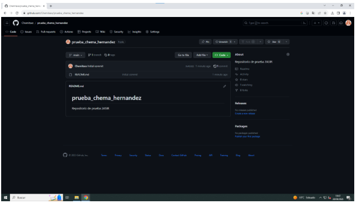

# Titulo principal

## Subtítulo

Esto es un párrafo, con palabras en **negrita**, también algo escrito en *cursiva*, y también algo escrito en ```código como esto```.

Ahora vamos a hacer algo en código como esto:  
``` 
git config --global user.name "John Doe"
git config --global user.email johndoe@example.com
 ```

Ahora una lista ordenada:
1. Primer elemento
2. Segundo elemento
3. Tercer elemento

Lista desordenada:  
- Primer elemento
- Segundo elemento
- Tercer elemento

Un enlace a una URL externa:  
[Moodle](https://campus.educantabria.es/)


Otro fichero Markdown:  
[Taller1](%23%20Taller%201.md)


Una imagen:  


Una tabla:  

| Columna 1 | Columna 2 | Columna 3 |
|-----------|-----------|-----------|
| Fila 1    | Celda 2   | Celda 3   |
| Fila 2    | Celda 5   | Celda 6   |
| Fila 3    | Celda 8   | Celda 9   |