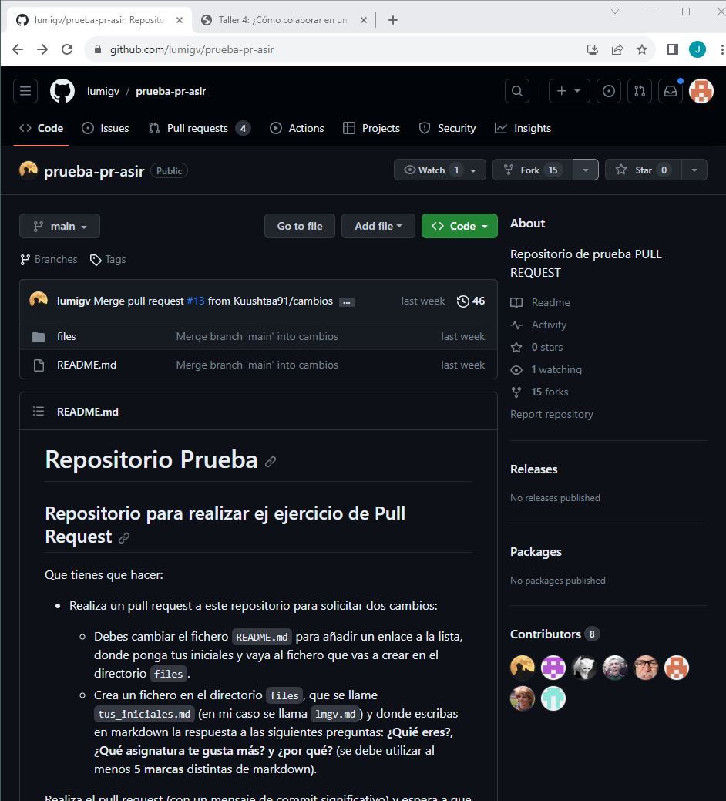
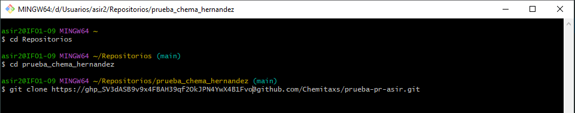
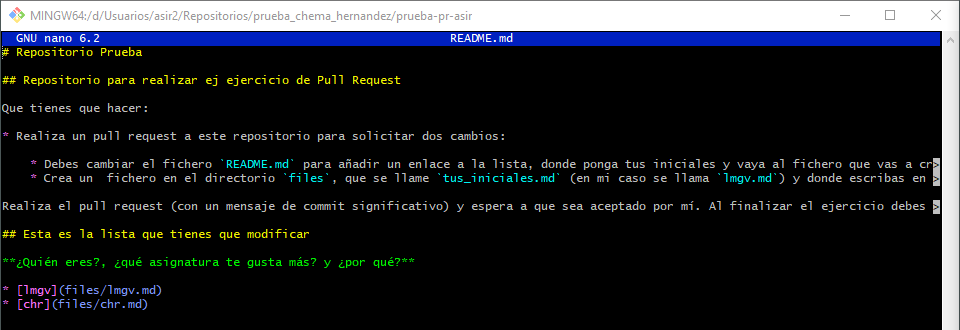
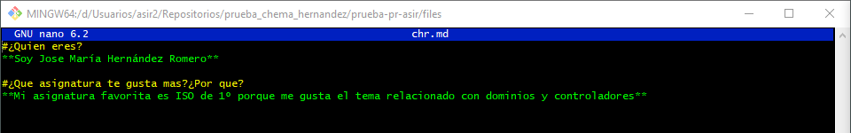
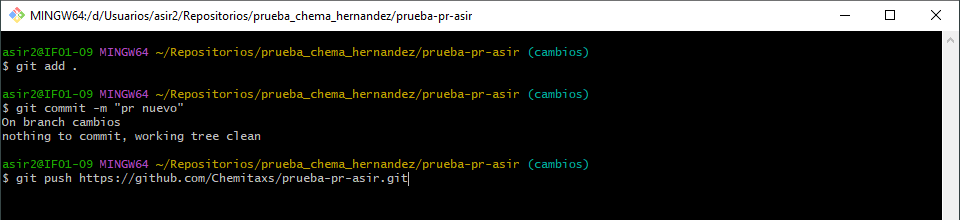
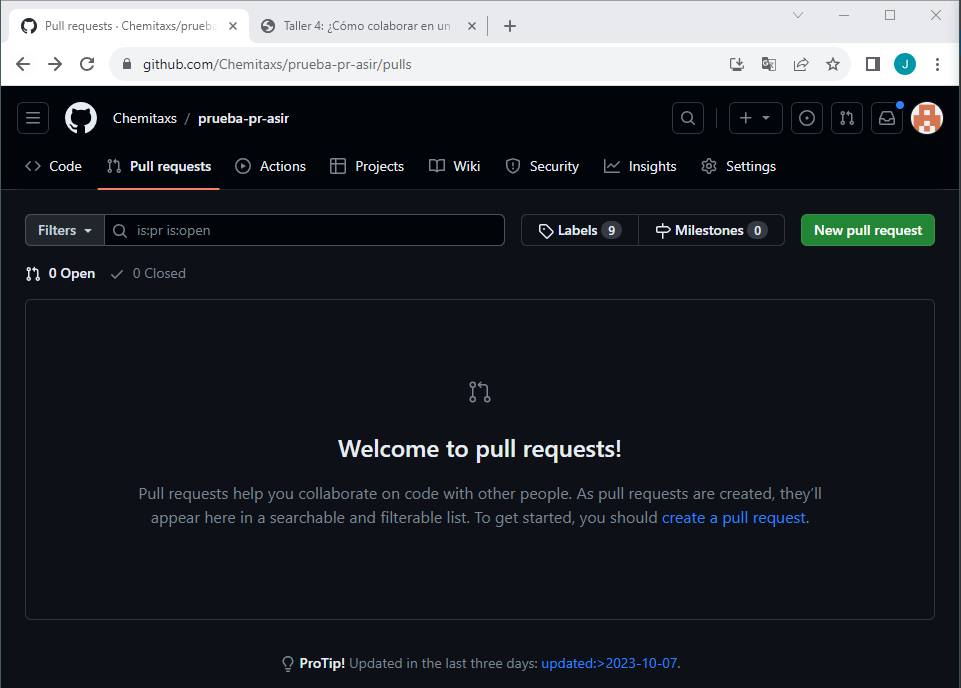
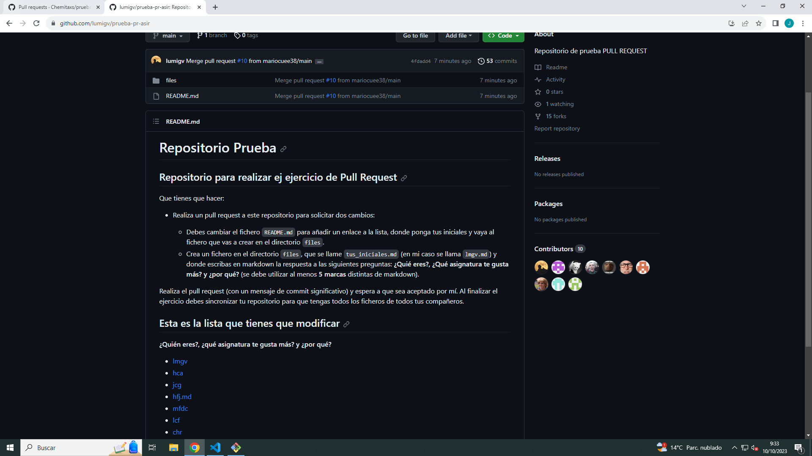

# Taller 4 Github

Lo primero que tenemos que hacer es ir al repositorio que nos ofrece la práctica que e el del cual realizarmos el pull request.  
Una vez dentro del repositorio tendremos que reealizar un fork para tener el Repositorio de la práctica dentro de nuestros propios repositorios.  
En mi caso ya lo tengo dentro 



Con eso ya estará dentro de nuestro Repositorio remoto una copia. Ahora lo que queremos hacer es mandar nuestro repositorio remoto a nuestro repositorio local. Para ello vamos a nuestro Git Bash y vamos a nuestra carpeta prueba_chema_hernandez, donde quermos guardar el repositorio local.  
Dentro de aqui usamos el git clone con el HTTPS de nuestro repositorio remoto con el token pra copiarlo en el local



Una vez clonado, vamos dentro de nuestro repositorio clonado y ahi tendremos que modificar el fichero README.md añadiendo un enlace con nuestra inicales a la lista,  y dicho enlace debe llevar a un fichero que mande a files.



Una vez modificado tendremos que crear dentro de un fichero Markdown en el directorio files, y en dicho Markdown tenemos que responder a las preguntas de:  
**¿Quien eres?, ¿Qué asignatura te gusta más? y ¿por qué?**



Una vez completado esto tenemos que subir nuestro repositorio local, con el repositorio remoto.  
Para ello tenemos que hacer uso de los siguientes comandos:
```
git add .
git commit -m "pr nuevo"
git push https://github.com/Chemitaxs/prueba-pr-asir.git
```  
En mi caso no me deja hacer el commit porque ya lo hice anteriormente.



Una vez hecho, tenemos que ir a nuestro repositorio remoto para comprobar que se han realizado los cambios correctamente.  
Si esta todo correctamente, tenemos que pedir nosotros el pull request que tendra que aceptar el dueño del repositorio original, para que se junten en una.  
En mi caso no aparece para hacer el pull request porque ya lo hice, pero en el apartado de Pull request nos tendria que salir para poder hacer la petición.



Por último, una vez sea aceptado nuestro pull request, podemos ver que los cambbios que realizamos estan en el repositorio original.

